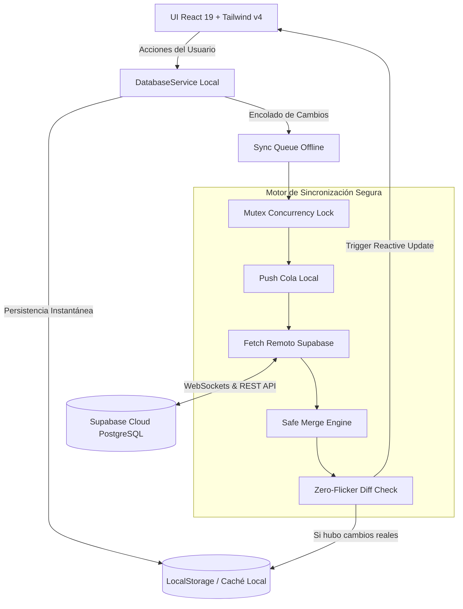

# 🚀 ReqTracker

<div align="center">


### **Gestor de Proyectos, Requerimientos & Banco de Ideas Multiplataforma**
*Rápido, nativo, ligero, offline-first y con sincronización bidireccional continua en la nube.*

[](https://github.com/CarlosGaubert/ReqTracker/releases)
[](https://tauri.app/)
[](https://react.dev/)
[](https://www.rust-lang.org/)
[](https://supabase.com/)
[](LICENSE)

[Descargas de Release](#-descargas-e-instalación) • [Características](#-características-principales) • [Configuración Supabase](#-configuración-de-la-nube-supabase) • [Desarrollo](#-instalación-y-desarrollo-local) • [Solución macOS Gatekeeper](#-nota-importante-para-usuarios-de-macos-gatekeeper)

</div>

---

## 📖 Descripción General

**ReqTracker** es una aplicación de escritorio moderna de alto rendimiento diseñada para desarrolladores, gestores de producto y profesionales que necesitan organizar proyectos, dar seguimiento riguroso a entregables y fechas límite, y registrar notas rápidas sin distracciones.

Construida con **Tauri v2** y **React**, aprovecha la velocidad y seguridad de **Rust** en el backend para consumir una fracción mínima de memoria RAM (a diferencia de las aplicaciones basadas en Electron), ofreciendo una interfaz de usuario fluida, reactiva y elegante. 

Su arquitectura **Offline-First** te permite trabajar sin interrupciones sin importar la calidad de tu conexión, mientras que su motor de **Sincronización Bidireccional Continua** se integra de manera directa con tu base de datos en **Supabase** mediante credenciales API privadas, sin intermediarios ni cuentas de usuario obligatorias.

---

## ✨ Características Principales

### 🗂️ 1. Gestión Integral de Proyectos
- Crea, renombra, organiza y elimina proyectos con facilidad.
- Visualiza métricas instantáneas de requerimientos asociados, estados de avance y fechas críticas.
- Selector de proyecto activo con navegación rápida y diseño ergonómico.

### ⏰ 2. Seguimiento de Requerimientos (To-Dos)
- Clasificación de tareas en tres estados dinámicos: **Pendiente (`To-Do`)**, **En Progreso (`In-Progress`)** y **Completado (`Done`)**.
- Asignación de fechas de creación y estimadas de entrega.
- Cálculo automático de proximidad de entrega con alertas visuales de urgencia.

### 🔔 3. Motor Inteligente de Alarmas y Notificaciones Nativas
- Monitor en segundo plano que inspecciona periódicamente tus compromisos.
- Detección preventiva de requerimientos a **3 días o menos de su fecha límite**.
- Disparo de **notificaciones nativas del sistema operativo** (macOS Notification Center, Windows Toast y Linux Desktop Notifications) con conmutador individual por requerimiento.

### 💡 4. Banco de Ideas & Notas Rápidas
- Espacio dedicado para capturar lluvia de ideas, reflexiones técnicas o requerimientos preliminares.
- Tarjetas interactivas con edición en tiempo real, conteo de caracteres y eliminación directa.

### 🔄 5. Sincronización Bidireccional Continua (Cloud Safe-Sync)
- **Tiempo Real & Polling Inteligente:** Sincroniza cambios automáticamente mediante canales WebSocket (Supabase Realtime) y comprobación periódica configurable (15s, 30s recomendados, 1 min, 5 min o solo manual).
- **Control de Concurrencia (Mutex):** Bloqueo anti-colisiones que garantiza que múltiples peticiones de sincronización no interfieran entre sí ni corrompan el almacenamiento.
- **Merge Seguro (Safe Merge):** Fusión inteligente que protege tus modificaciones locales aún no enviadas a la nube, previniendo sobreescrituras accidentales.
- **Zero-Flicker Experience:** Comparación estructural por hash/digest para actualizar la interfaz únicamente cuando existen cambios reales en los datos, evitando molestos parpadeos.
- **Sincronización Bidireccional de Bajas:** Respeta eliminaciones en ambos extremos; lo que borres en Supabase se remueve del cliente local, y viceversa.
- **Indicador de Estado en Vivo:** Visualiza en la barra lateral el tiempo transcurrido desde la última sincronización (*"hace instantes"*, *"hace 20s"*, etc.).

### 🔍 6. Paleta de Comandos Universal (`Cmd + K` / `Ctrl + K`)
- Abre el buscador global instantáneo desde cualquier pantalla con el atajo de teclado estándar.
- Busca por nombre de proyecto, título de requerimiento, descripción o contenido de ideas.
- Acciones directas y salto inmediato al elemento seleccionado.

### 🌓 7. Modo Oscuro / Claro & Tipografía Geist
- Soporte nativo para temas Claro y Oscuro con persistencia automática.
- Integración de tipografía de vanguardia [Geist Font](https://vercel.com/font) para máxima legibilidad y confort visual.
- Paleta de colores refinada, bordes sutiles y micro-interacciones pulidas con Tailwind CSS v4.

### ⚡ 8. Actualizador Automático Criptográfico (Auto-Updater)
- Comprobación nativa de nuevas versiones al iniciar o bajo demanda.
- Descarga e instalación asistida en un clic con verificación de firmas criptográficas **Minisign**.

---

## 🏛️ Arquitectura del Sistema



---

## 📥 Descargas e Instalación

Puedes descargar el instalador oficial más reciente para tu plataforma desde [GitHub Releases](https://github.com/CarlosGaubert/ReqTracker/releases/latest):

| Plataforma | Arquitectura | Formato de Instalador |
| :--- | :--- | :--- |
| 🍎 **macOS** | Apple Silicon (M1/M2/M3/M4) | `.dmg`, `.app.tar.gz` |
| 🍎 **macOS** | Intel (x86_64) | `.dmg`, `.app.tar.gz` |
| 🖥️ **Windows** | 64-bit (x64) | `.msi`, `.exe` |
| 🐧 **Linux** | 64-bit (x64) | `.deb`, `.AppImage` |

---

## 🍎 Nota importante para usuarios de macOS (Gatekeeper)

Al descargar la aplicación en macOS directamente desde el navegador o GitHub, el mecanismo de seguridad de Apple (Gatekeeper) puede desplegar el aviso:

> ⚠️ **"ReqTracker está dañado y no puede abrirse. Deberías moverlo al basurero."**

Esto es completamente normal en aplicaciones open-source sin firma notariada de pago de Apple Developer. **El binario es 100% seguro y limpio.**

### Solución en 1 comando:
1. Mueve `ReqTracker.app` a tu carpeta `/Applications` (Aplicaciones).
2. Abre la **Terminal** y ejecuta:
   ```bash
   xattr -cr /Applications/ReqTracker.app
   ```
3. ¡Listo! Abre ReqTracker con total normalidad desde tu Launchpad o Spotlight.

*Vía interfaz gráfica:* Puedes ir a **Ajustes del Sistema > Privacidad y Seguridad** y en el apartado *Seguridad* hacer clic en **"Abrir de todos modos"**.

---

## ☁️ Configuración de la Nube (Supabase)

ReqTracker no requiere ningún servidor backend propio. Para habilitar la sincronización entre dispositivos:

1. Crea una cuenta gratuita en [Supabase](https://supabase.com/) y crea un nuevo proyecto.
2. Dirígete a **Project Settings > API** y copia tu **Project URL** y tu **Anon Key** (pública).
3. En **ReqTracker**, ve al menú **Ajustes & Sync**, ingresa las credenciales y pulsa **Guardar y Probar Conexión**.
4. En el **SQL Editor** de tu panel de Supabase, ejecuta el siguiente script para crear las tablas con soporte para borrado en cascada:

```sql
-- 1. Tabla de Proyectos
create table if not exists projects (
  id uuid primary key,
  name text not null,
  description text default '',
  created_at timestamp with time zone default timezone('utc'::text, now()) not null
);

-- 2. Tabla de Requerimientos
create table if not exists requirements (
  id uuid primary key,
  project_id uuid references projects(id) on delete cascade not null,
  title text not null,
  description text default '',
  status text not null check (status in ('todo', 'in-progress', 'done')),
  created_at timestamp with time zone default timezone('utc'::text, now()) not null,
  estimated_date text not null,
  alarm_enabled boolean default true not null,
  notified boolean default false not null
);

-- 3. Tabla de Ideas Rápidas
create table if not exists ideas (
  id uuid primary key,
  title text not null,
  content text default '',
  created_at timestamp with time zone default timezone('utc'::text, now()) not null
);

-- Índices recomendados para optimizar el rendimiento
create index if not exists idx_requirements_project_id on requirements(project_id);
create index if not exists idx_requirements_status on requirements(status);
create index if not exists idx_requirements_estimated_date on requirements(estimated_date);

-- Habilitar Realtime en las tablas (opcional pero recomendado)
alter publication supabase_realtime add table projects;
alter publication supabase_realtime add table requirements;
alter publication supabase_realtime add table ideas;
```

---

## 🛠️ Instalación y Desarrollo Local

Si deseas compilar la aplicación por tu cuenta o contribuir al código:

### Prerrequisitos
- **Node.js**: v18.0 o superior ([nodejs.org](https://nodejs.org/))
- **Rust & Cargo**: Versión estable más reciente ([rustup.rs](https://rustup.rs/))
- **Herramientas del sistema:**
  - **macOS:** Xcode Command Line Tools (`xcode-select --install`).
  - **Windows:** C++ Build Tools (Visual Studio Installer).
  - **Linux:** `sudo apt-get install -y libwebkit2gtk-4.1-dev libappindicator3-dev librsvg2-dev patchelf xdg-utils`.

### Pasos de Construcción

1. **Clonar el repositorio:**
   ```bash
   git clone https://github.com/CarlosGaubert/ReqTracker.git
   cd ReqTracker
   ```

2. **Instalar dependencias de Node:**
   ```bash
   npm install
   ```

3. **Ejecutar en entorno de desarrollo con Hot-Reload:**
   ```bash
   npm run tauri dev
   ```

4. **Ejecutar la suite de validación de release:**
   ```bash
   npm run verify
   ```

5. **Compilar los instaladores de producción locales:**
   ```bash
   npm run tauri build
   ```

---

## 🧪 Pila Tecnológica

| Área | Tecnología | Propósito |
| :--- | :--- | :--- |
| **Core & Runtime** | [Tauri v2](https://tauri.app/) | Empaquetador nativo multiplataforma ultraligero y seguro. |
| **Sistemas** | [Rust](https://www.rust-lang.org/) | Gestión de bandeja del sistema, ciclo de vida de ventana y notificaciones. |
| **Frontend Framework** | [React 19](https://react.dev/) + [TypeScript](https://www.typescriptlang.org/) | Interfaz declarativa, tipada y reactiva. |
| **Bundler** | [Vite 7](https://vite.dev/) | Compilación ultrarrápida y Hot Module Replacement (HMR). |
| **Estilos & UI** | [Tailwind CSS v4](https://tailwindcss.com/) | Motor de estilos atómicos de nueva generación. |
| **Iconografía** | [Lucide React](https://lucide.dev/) | Conjunto de iconos limpio y consistente. |
| **Tipografía** | [Geist Variable](https://vercel.com/font) | Tipografía geométrica de alta definición. |
| **Nube & Base de Datos** | [Supabase](https://supabase.com/) | Almacenamiento PostgreSQL distribuido y WebSockets en tiempo real. |
| **Seguridad & Firma** | [Minisign](https://jedisct1.github.io/minisign/) | Verificación de firmas criptográficas para actualizaciones remotas. |

---

## 📦 Flujo de Publicación Automatizada (CI/CD)

El proyecto cuenta con un workflow en GitHub Actions (`.github/workflows/release.yml`) que automatiza por completo la distribución de binarios:

1. Se genera un commit y se etiqueta con una versión `v*` (ejemplo: `v1.2.7`).
2. Se envía el tag a GitHub (`git push origin v1.2.7`).
3. GitHub Actions inicia 4 compilaciones paralelas en runners nativos de macOS, Windows y Linux.
4. Se firman digitalmente los artefactos con la clave privada de Minisign.
5. Se publica automáticamente un nuevo **Release** en GitHub con todos los instaladores listos para los usuarios.

---

## 📄 Licencia

Este proyecto está bajo la Licencia **MIT**. Consulta el archivo `LICENSE` para más detalles.

---

<div align="center">
Desarrollado con ❤️ por <b>Carlos Gaubert</b>
</div>
